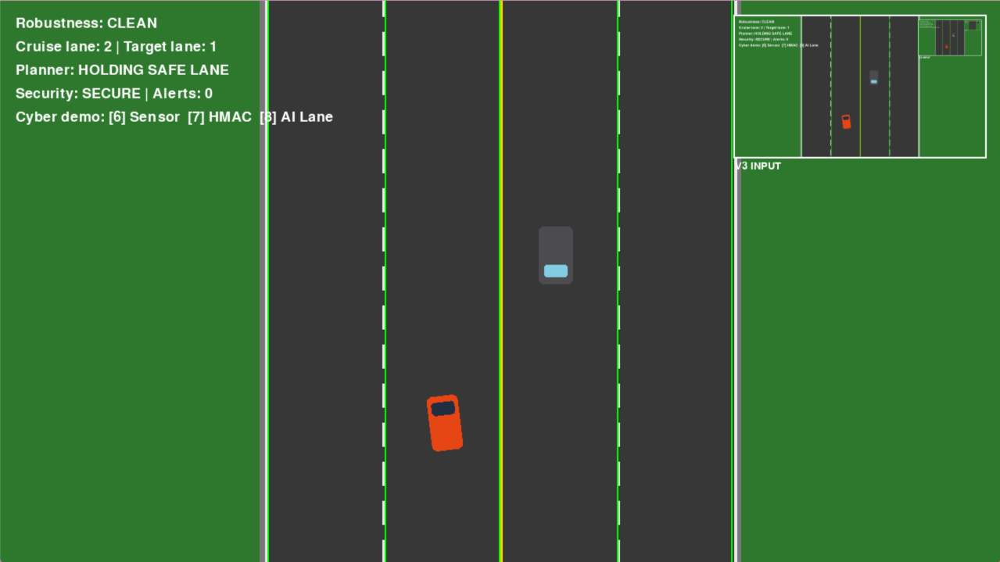
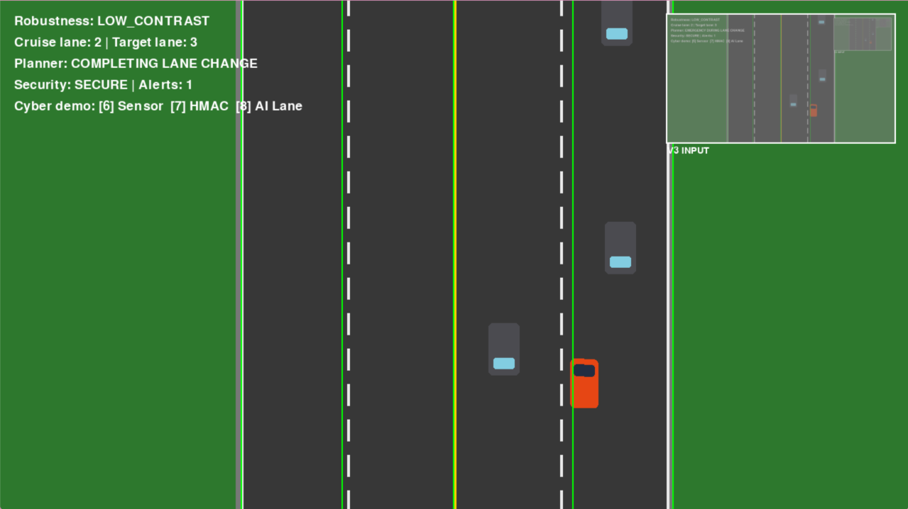
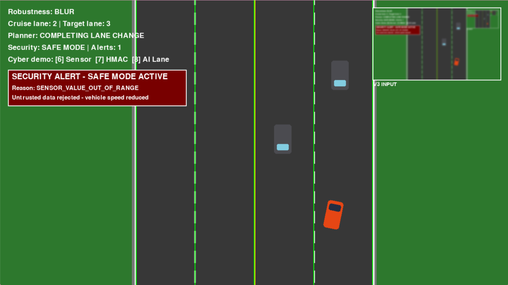
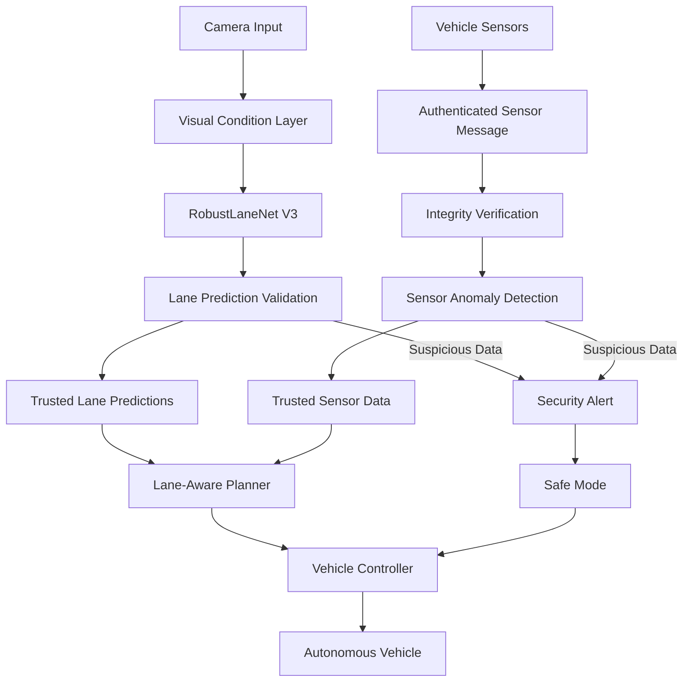
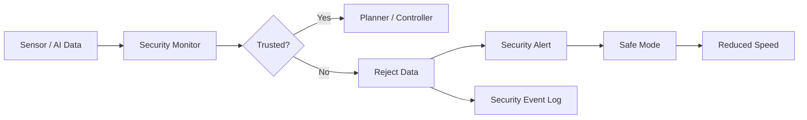

# 🚗 Cyber-Resilient AI for Robust Autonomous Vehicle Navigation

### Robust Perception • Closed-Loop Driving • Adverse-Condition Testing • Cyber-Resilience

> **Built to drive. Tested to degrade. Designed to reject untrusted data.**

A simulation-based autonomous vehicle research platform combining **deep-learning lane perception**, **closed-loop autonomous navigation**, **obstacle avoidance**, **visual robustness evaluation**, and a **lightweight cyber-resilience layer**.

---

---

## 🎥 Project Demo

### 🚗 Autonomous Driving

RobustLaneNet V3 performs lane perception in real time while the lane-aware planner and controller manage vehicle navigation and obstacle avoidance.

<p align="center">
  
</p>

---

### 🌧️ Robustness Under Adverse Visual Conditions

The same trained perception model is evaluated under degraded visual inputs including noise, blur, low contrast, and occlusion.

<p align="center">
  
</p>

---

### 🛡️ Cyber-Resilience Demonstration

The simulator includes a lightweight defensive security layer capable of detecting suspicious sensor or AI data, rejecting untrusted values, and activating temporary Safe Mode.

<p align="center">
  
</p>

---

## 🔬 Research Motivation

Autonomous vehicles depend heavily on perception systems that must remain reliable when environmental conditions become difficult.

A lane-detection system that performs well on clean images may behave very differently under:

- image noise,
- blur,
- low contrast,
- partial occlusion,
- or corrupted input data.

This project investigates those challenges through a controlled autonomous-driving simulation environment.

> **“I established a classical Canny-Hough baseline, systematically degraded the visual input, quantified its failure modes, then investigated a lightweight CNN architecture specifically designed for robustness under adverse visual conditions, and compared the two under identical conditions.”**

The project evolved from classical computer vision toward a trained neural perception model, followed by closed-loop vehicle integration and a lightweight cybersecurity layer.

---

## 🎯 Research Question

> **How can an autonomous vehicle maintain reliable perception and safe behavior when its visual environment degrades or when its input data becomes untrustworthy?**

The project explores this question through three main themes:

**Robust Perception → Autonomous Decision-Making → Cyber-Resilience**

---

# 🧠 System Architecture



The trained neural network is responsible for **lane perception**.

Obstacle avoidance and maneuver decisions are handled by deterministic planning logic, while steering, throttle, and braking are generated by a mathematical vehicle controller.

---

# 🔄 Research Pipeline

```text
Autonomous Driving Simulator
            ↓
Synthetic Dataset Generation
            ↓
Classical Canny-Hough Baseline
            ↓
Baseline Robustness Evaluation
            ↓
RobustLaneNet V1 / V2 / V3
            ↓
Perception Robustness Evaluation
            ↓
Closed-Loop AI Integration
            ↓
Lane-Aware Obstacle Avoidance
            ↓
Five-Condition Final Evaluation
            ↓
Cyber-Resilience Layer
```

---

# 👁️ RobustLaneNet V3

**RobustLaneNet V3** is a lightweight convolutional neural network developed for lane-boundary perception inside the simulator.

The model receives a simulated road image and predicts five horizontal lane-boundary positions:

```text
[road_left, lane_1, center_line, lane_2, road_right]
```

A typical prediction is approximately:

```text
[342, 493, 639, 789, 937]
```

These predictions are used directly by the autonomous vehicle to determine the target center of the selected lane.

This means the trained neural network is not only evaluated offline — it is integrated into the actual **closed-loop driving pipeline**.

---

# 🚘 Closed-Loop Autonomous Driving

The final vehicle pipeline is:

```text
Camera Image
     ↓
RobustLaneNet V3
     ↓
Predicted Lane Boundaries
     ↓
Target Lane Center
     ↓
Lane-Aware Planner
     ↓
Vehicle Controller
     ↓
Steering / Throttle / Braking
     ↓
Autonomous Vehicle
```

The planner can generate decisions such as:

```text
FORWARD
LEFT
RIGHT
SLOW
STOP
```

It considers:

- front obstacle distance,
- adjacent-lane availability,
- traffic positions,
- lane gaps,
- time-to-collision estimates,
- ongoing lane changes,
- emergency conditions.

---

# 🛣️ Classical Vision Baseline

Before developing the neural model, the project established a classical computer-vision baseline using **Canny edge detection** and the **Hough Line Transform**.

```text
Input Image
     ↓
Grayscale Processing
     ↓
Canny Edge Detection
     ↓
Hough Line Transform
     ↓
Lane Estimate
```

This provided an interpretable reference point for studying how traditional vision techniques degrade under adverse visual conditions.

The same corruption categories were later used to evaluate the learned model.

---

# 🌧️ Visual Robustness Evaluation

The final system was evaluated under five visual conditions:

| Condition | Description |
|---|---|
| **Clean** | Original simulator image |
| **Noise** | Gaussian image noise |
| **Blur** | Strong Gaussian blur |
| **Low Contrast** | Reduced visual contrast |
| **Occlusion** | Partial obstruction of the image |

The same trained RobustLaneNet V3 model was used across all conditions.

---

# 📊 Final Closed-Loop Results

| Condition | Collisions | Avoidance Success | Stable Lane Error | Perception Error | Avg. Speed | Off-Road Frames |
|---|---:|---:|---:|---:|---:|---:|
| **Clean** | 3 | 75% | **1.04 px** | 2.37 px | 7.31 | **0** |
| **Noise** | 3 | 100% | 3.22 px | **1.67 px** | 7.26 | **0** |
| **Blur** | 3 | 75% | 2.35 px | 4.84 px | 7.35 | **0** |
| **Low Contrast** | 3 | 100% | 8.05 px | 7.21 px | 7.22 | **0** |
| **Occlusion** | **2** | 100% | 3.28 px | 2.67 px | **7.43** | **0** |

### Main observations

RobustLaneNet V3 remained operational under every tested corruption.

The largest perception degradation occurred under **low-contrast imagery**, followed by **blur**.

No off-road frames were recorded during the final five-condition evaluation.

The vehicle's average speed also remained relatively stable across all tested conditions.

The results represent a controlled simulator evaluation rather than a large-scale statistical real-world benchmark.

---

# 🛡️ Cyber-Resilience Layer

The final simulator includes a lightweight defensive cybersecurity layer designed to prevent suspicious sensor or AI data from being blindly trusted by the autonomous system.



The security layer includes:

| Protection | Function |
|---|---|
| **HMAC-SHA256** | Detects modified authenticated sensor messages |
| **Sensor anomaly detection** | Rejects impossible or suspicious values |
| **AI-output validation** | Detects invalid lane predictions |
| **Trusted-data fallback** | Prevents corrupted values from reaching control |
| **Safe Mode** | Temporarily reduces vehicle speed after an alert |
| **Security logging** | Records cybersecurity events |

---

# 🔐 Simulated Cyberattack Demonstrations

Three controlled security scenarios were implemented inside the simulator.

## 1. Sensor Spoofing

A physically impossible sensor value is injected:

```text
Normal front distance
        ↓
      -500
        ↓
Anomaly Detection
        ↓
Value Rejected
        ↓
Safe Mode
```

---

## 2. Message Tampering

A legitimate sensor message is authenticated using HMAC-SHA256.

The payload is then altered without recomputing the signature.

```text
Authenticated Message
        ↓
Payload Modified
        ↓
Signature Mismatch
        ↓
Integrity Failure
        ↓
Message Rejected
```

---

## 3. AI Lane Spoofing

A normal prediction:

```text
[342, 493, 639, 789, 937]
```

is modified to:

```text
[342, 493, 639, 789, 1700]
```

Because `1700 px` lies outside the valid image width, the security monitor rejects the prediction.

The system instead retains the previous trusted lane estimate and enters temporary Safe Mode.

> These cybersecurity scenarios are simulator-only defensive demonstrations. They are not presented as a complete production automotive intrusion-detection system.

---

# 🧩 Project Structure

```text
.
├── ai/
│   ├── controller.py
│   ├── navigation.py
│   ├── obstacle_avoidance.py
│   └── perception.py
│
├── simulator/
│   ├── engine.py
│   ├── camera.py
│   ├── vehicle.py
│   ├── world.py
│   ├── sensors.py
│   ├── vision.py
│   ├── traffic_manager.py
│   └── traffic_vehicle.py
│
├── security/
│   ├── integrity.py
│   ├── security_monitor.py
│   └── security_logger.py
│
├── planning/
│
├── research/
│   ├── baseline/
│   ├── robust_model/
│   ├── robustness/
│   ├── evaluate_v3.py
│   ├── final_evaluation.py
│   └── security_demo.py
│
├── results/
│   ├── final_evaluation/
│   ├── metrics/
│   └── robustness_evaluation/
│
├── tests/
├── main.py
├── requirements.txt
└── README.md
```

---

# ⚙️ Installation

Clone the repository:

```bash
git clone https://github.com/SabrinaBenghename/Robust-AI-Autonomous-Vehicle-Navigation-with-Cyber-Resilience.git
```

Enter the repository:

```bash
cd Robust-AI-Autonomous-Vehicle-Navigation-with-Cyber-Resilience
```

Install the required Python packages:

```bash
pip install -r requirements.txt
```

---

# ▶️ Run the Simulator

```bash
python main.py
```

The simulator starts in autonomous-driving mode with RobustLaneNet V3 integrated into the driving pipeline.

---

# 🎮 Controls

| Key | Action |
|---|---|
| `A` | Toggle autonomous driving |
| `1` | Clean condition |
| `2` | Noise |
| `3` | Blur |
| `4` | Low contrast |
| `5` | Occlusion |
| `6` | Simulated sensor spoofing |
| `7` | Simulated HMAC/message tampering |
| `8` | Simulated AI lane spoofing |
| `T` | Automatically cycle robustness conditions |
| `ESC` | Exit |

---

# 📁 Research Results

Final closed-loop results are stored in:

```text
results/final_evaluation/
```

including:

```text
clean.json
noise.json
blur.json
low_contrast.json
occlusion.json
final_summary.csv
final_summary.json
```

---

# 🧰 Technology Stack


**Core technologies**

- Python
- PyTorch
- OpenCV
- Pygame
- NumPy
- Deep Learning
- Computer Vision
- Autonomous Driving
- Cybersecurity
- Simulation

---

# ⚠️ Limitations

This project is a research simulator rather than a production autonomous-driving system.

Current limitations include:

- synthetic simulator data,
- primarily straight-road geometry,
- simplified vehicle dynamics,
- lane-boundary regression rather than full curved-lane geometry,
- deterministic obstacle avoidance rather than learned behavior planning,
- one controlled final evaluation run per visual condition,
- simulator-only cybersecurity demonstrations.

These limitations define clear directions for future work.

---

# 🔭 Future Research Directions

Potential extensions include:

- curved and more complex road geometries,
- real-world lane datasets,
- larger-scale robustness evaluation,
- sensor fusion,
- temporal perception models,
- learned behavior planning,
- richer multi-agent traffic environments,
- automotive communication-security experiments.

---

# 📄 Research Paper

A research-style paper based on this project is linked in my CV.

Planned sections include:

```text
Abstract
Introduction
Related Work
Simulation Environment
Classical Canny-Hough Baseline
RobustLaneNet V3
Adverse-Condition Robustness
Closed-Loop Autonomous Driving
Cyber-Resilience Architecture
Experimental Results
Discussion
Limitations
Conclusion
```

---

# 🚗 Project Philosophy

This project was not built only to demonstrate a simulated car moving along a road.

It was built to investigate how an autonomous system behaves when the assumptions behind its perception pipeline begin to fail.

The project therefore connects three problems that are increasingly important in autonomous systems:

> **Can the vehicle perceive reliably?**

> **Can it continue driving safely when perception degrades?**

> **Can it recognize when the data it receives should no longer be trusted?**

---

## ⭐ Cyber-Resilient AI for Robust Autonomous Vehicle Navigation

**Robust perception. Autonomous decision-making. Cyber-resilience.**
