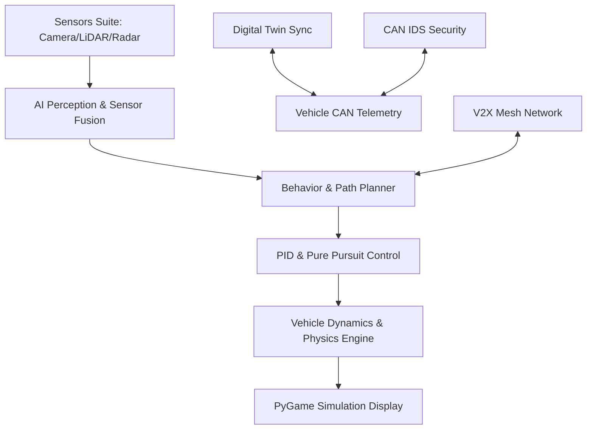

# AI Autonomous Vehicle Platform Architecture

Overview of software architecture, functional layers, and data pipelines powering the Autonomous Vehicle Platform.

## Core Modules

1. **`simulator/`**: PyGame engine, physics kinematics, road generation, traffic, pedestrians, and camera tracking.
2. **`ai/`**: Unified perception pipelines, path planning (A*), behavior state machines, and motion controllers.
3. **`digital_twin/`**: Real-time cloud sync, telemetry diagnostics, and predictive maintenance.
4. **`cybersecurity/`**: CAN bus Intrusion Detection System (IDS) and V2X message authentication.
5. **`multi_agent/`**: V2V mesh communications and cooperative platooning.
